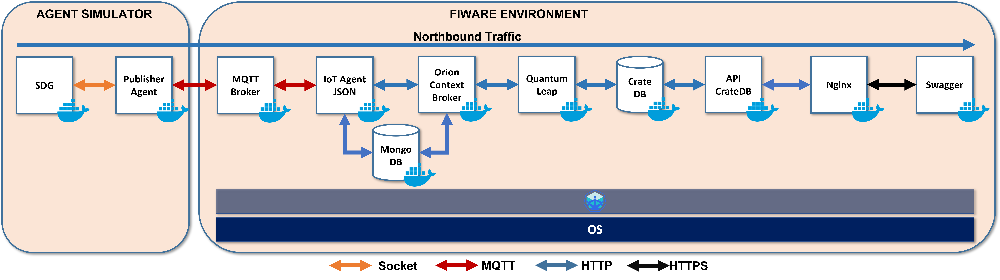

# Prod Mode: FIWARE Deployment for Positioning System

This project constitues the *Production Mode* of the [Fiware Development for Positioning System](https://github.com/PositioningSystem/FiwareDevModeForPositionSystem) project. This is project is an ad-hoc implementation for sending positioning data using the [SDG](https://github.com/sfl0r3nz05/CSV-Data-Sender.git) and [Publisher Agent](https://github.com/sfl0r3nz05/Publisher-Agent.git) projects.

## Architecture

