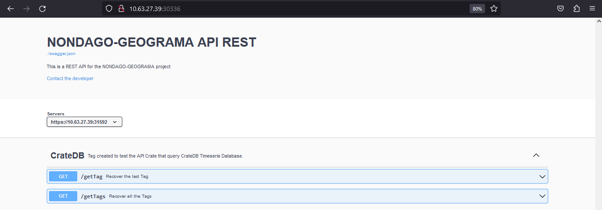

# Sending data on deployed components

1. Once service has been deployed, the NodePort type must be enabled to syncronize the `publisher agent` with the `MQTT broker`.

    - mosquitto:

        ```console
        kubectl edit service mosquitto -n fiware
        ```

    - Inspect mosquitto *service*:
        
        ```console
        export NODE_IP=$(kubectl get nodes --namespace fiware -o jsonpath="{.items[0].status.addresses[0].address}")
        ```
        
        ```console
        export NODE_PORT=$(kubectl get --namespace fiware -o jsonpath="{.spec.ports[0].nodePort}" services mosquitto)
        ```
        
        ```console
        echo "URL : mqtt://$NODE_IP:$NODE_PORT/"
        ```

    - Add `host` as `network_mode` for the `Publisher-Agent`. Sample of result:
    
        ```console        
        services:
          publisher-agent:
            container_name: publisher
            hostname: publisher
            build:
              context: .
            volumes:
              - ./src:/publisher-agent/src
            environment:
              - PROTOCOL=MQTT # Must be set to AMQP or MQTT
              - AMQP_QUEUE_HOST=rmq0
              - AMQP_QUEUE_PORT=5672
              - MQTT_QUEUE_HOST=10.63.27.39
              - MQTT_QUEUE_PORT=30519
              - TOPIC=/5jggokgpepnvsb2uv4s40d59ov/tag001/attrs
            ports:
              - 8053:8053
            network_mode: "host"
        ```

2. Add `host` as `network_mode` for the `CSV-Data-Sender`. Sample of result:

    
    ```console
    services:
      synthetic-data-generator-file:
        container_name: csv-data-sender
        build:
          context: .
        environment:
          - SOCK_LISTENER_HOST=10.63.27.39
          - SOCK_LISTENER_PORT=8053
          - SLEEP_TIME=0.9
        network_mode: "host"
    ```

3. Go into provision folder:

    ```console
    cd ~/FiwareProdModeForPositionSystem/provision/
    ```

4. Sending data on deployed components

    ```console
    ./services start
    ```

5. Enable `NodePort` in swagger service to use the API:

    ```console
    kubectl edit service swagger -n fiware
    ```

    - Inspect swagger *service*:
        
        ```console
        export NODE_IP=$(kubectl get nodes --namespace fiware -o jsonpath="{.items[0].status.addresses[0].address}")
        ```
        
        ```console
        export NODE_PORT=$(kubectl get --namespace fiware -o jsonpath="{.spec.ports[0].nodePort}" services swagger)
        ```
        
        ```console
        echo "URL : http://$NODE_IP:$NODE_PORT/"
        ```
    
    - Use the url in the browser:

       